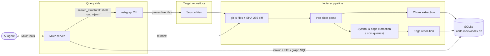

# Architecture

> **Status:** target architecture for a system not yet built. The core index design is ported from a working Swift/GRDB implementation (the `CodeIndex` feature of `stapler-workstation-native`); the AST graph and ast-grep integration are new design. See [ported vs. new](#ported-vs-new).

## Problem

AI coding agents burn their context window learning a codebase: `grep` returns walls of matches, and answering "what calls this?" means opening file after file at hundreds or thousands of tokens each. Most of that text is read once, used for one judgment, and then occupies context for the rest of the session.

This project gives agents **structural answers instead of raw text**: "the outline of this file", "the callers of this function", "the modules this depends on" — each in tens of tokens, with a cheap drill-down path when the agent genuinely needs a body.

## Design principles

1. **Index once, query many.** Parsing with tree-sitter happens at index time; agent queries are millisecond SQLite reads.
2. **Summaries with IDs, bodies on demand.** Every answer is names/signatures/locations plus an id; `get_chunk` fetches one body when needed.
3. **Structure over text.** Symbol lookup, graph traversal, and AST-pattern search replace text grep wherever the question is structural.
4. **Incremental and self-healing.** Hash-based change detection makes every run incremental; the database is a pure cache, so corruption is handled by quarantine-and-rebuild, never repair.

## Components

| Component | Responsibility | Details |
|---|---|---|
| **Indexer pipeline** | Discover files (`git ls-files`), detect changes (SHA-256), parse (tree-sitter), extract chunks + symbols + edges, resolve edges, prune stale rows | [indexing.md](indexing.md) |
| **Storage layer** | One SQLite file per repo (`.code-index/index.db`, better-sqlite3, WAL): `indexed_files`, `code_chunks`, `symbols`, `edges`, FTS5 mirror, `meta`; migrations + health check | [schema.md](schema.md) |
| **Query layer** | Three retrieval modes — indexed lookup, FTS5 text search, ast-grep structural search — behind one result envelope | [search.md](search.md), [ast-graph.md](ast-graph.md) |
| **MCP server** | Stdio server exposing the query layer as agent tools; triggers reindex on startup | [mcp-server.md](mcp-server.md) |

## Data flow

Two things worth noticing:

- **ast-grep bypasses the database** and parses the working tree directly — it is the freshness-guaranteed path, while the database is the fast, token-cheap, possibly-seconds-stale path ([search.md](search.md#structural-search-ast-grep)).
- The MCP server owns the indexer: it reindexes incrementally on startup and exposes `reindex` so agents can refresh after editing.

## Ported vs. new

| Element | Origin |
|---|---|
| `indexed_files` / `code_chunks` schema, chunking strategy (meaningful-node allowlists, context_path/depth, 2000-char cap) | **Ported** from Swift reference |
| Discovery, SHA-256 change detection, stale pruning, quarantine-and-rebuild recovery | **Ported** from Swift reference |
| `symbols` / `edges` tables, `.scm` extraction, two-phase resolution | **New** |
| FTS5 ranked text search (replaces `LIKE '%q%'` scan) | **New** |
| ast-grep structural search integration | **New** |
| MCP server (the Swift version's consumer was a SwiftUI view) | **New** |

## Decision log

1. **`better-sqlite3` over `node:sqlite`.** Mature, synchronous API fits a synchronous pipeline; the project already carries native builds (tree-sitter), so one more native dep adds no new pain. `node:sqlite` (Node ≥ 22) noted as a future migration.
2. **FTS5** for text search — deliberate upgrade over the reference's `LIKE` scan; external-content table keeps storage near-zero extra.
3. **ast-grep via CLI shell-out with `--json`**, not `@ast-grep/napi`. Simpler, matches existing agent workflows, keeps ast-grep versioning independent. Cost: `ast-grep` is a runtime prerequisite for `search_structural` only. Revisit napi if it becomes a hot path.
4. **snake_case columns + ISO-8601 text dates** — diverges from the Swift camelCase schema; the two database files are not interchangeable.
5. **Graph = SQLite tables + recursive CTEs**, not a graph database. One file, one driver, fast at repo scale.
6. **Two-phase, best-effort edge resolution** — no type checker in v1; limits stated in [indexing.md](indexing.md#known-limitations).
7. **v1 languages: JavaScript, TypeScript, TSX.** Extension table ported from the reference; other grammars staged behind it.
8. **2000-char chunk content cap** carried over, with the FTS-truncation tradeoff recorded.
9. **The database is a cache, never a source of truth** — quarantine-and-rebuild is always acceptable; no repair paths.
10. **`git ls-files` for discovery** (gitignore handling for free), glob fallback for non-git directories.

## Non-goals

- **Semantic / embedding search** — structural + lexical retrieval first; embeddings are a possible later layer, not a v1 dependency.
- **Type-checker-grade resolution** — the graph is best-effort by design; TS compiler API integration is future work.
- **Cross-repo indexing** — one database, one repo.
- **Being an editor service** — this is agent tooling, not an LSP replacement.
