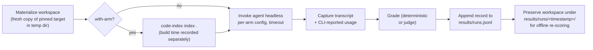

# Benchmark Suite

> **Status:** design for a suite not yet built. Running it requires at least M5 (a working MCP server, [prd.md §7](prd.md#7-milestones)); authoring tasks and the harness can start earlier. This document is the source for a future `BENCH-9xx` task series in [tasks.md](tasks.md), following the same DEV/QA pairing convention. Suite structure modeled on the [ponytail benchmarks](https://github.com/DietrichGebert/ponytail/tree/main/benchmarks) (its `agentic/` harness in particular).

## Purpose

The project's central claim is token efficiency: the worked rename example in [mcp-server.md](mcp-server.md#example-agent-session) costs ≈400 tokens through the index vs. ≈8,000 via grep-and-read. DEV-804 validates that number mechanically for the "with index" side. This suite is the end-to-end version: **real agent sessions, with and without the tools, measured**.

**Hypotheses:**

- **H1 (primary).** Within each agent, the with-index arm completes structural tasks at materially lower token cost with equal-or-better correctness.
- **H2 (secondary).** The effect replicates across two different agent CLIs (Claude Code and Codex).

**Confound, stated up front:** Claude Code and Codex run different underlying models. Cross-agent numbers are descriptive only — the unit of analysis is the paired **with-vs-without delta within each agent**, never "Claude beat Codex."

## Experimental design

Four arms — agent × index availability:

| Arm | Agent | code-index MCP tools | Baseline tools |
|---|---|---|---|
| `claude-with` | Claude Code (headless `claude -p`) | ✓ (all 11 tools) | read / grep / glob / bash |
| `claude-without` | Claude Code | ✗ | read / grep / glob / bash |
| `codex-with` | Codex CLI (`codex exec`) | ✓ | its native file/shell tools |
| `codex-without` | Codex CLI | ✗ | its native file/shell tools |

**Tool-parity rule:** within an agent, both arms get identical baseline tools; the with-arm is strictly additive. Nothing is taken away from the baseline.

- **N = 4 runs** per (task, arm) cell by default (configurable). Medians reported, ranges shown.
- Models pinned per agent via CLI flags; agent CLI version, harness version, task-set hash, and code-index version recorded in every result record.
- Comparisons are **paired per task**: for each task, with-arm median vs. without-arm median within the same agent.

## Task model

Following ponytail's pattern, tasks live in a code registry (`benchmarks/tasks.ts`), not loose spec files — the registry is typed, validated at load, and can mix hand-authored entries with generated ones.

```ts
interface BenchTask {
  id: string;                 // "whocalls-express-001"
  category: Category;         // see table below
  style: "qa" | "edit";
  target: string;             // named target from targets.ts, pinned commit
  prompt: string;             // exact prompt given to the agent
  grader: GraderRef;          // deterministic grader + its answer key, or judge rubric
  timeoutSec: number;
  tags: string[];             // "authored" | "generated:v1", size class, language
}
```

Categories map one-to-one onto the capabilities the index claims to accelerate ([tool catalog](mcp-server.md#tool-catalog)):

| Category | Question shape | Index tools exercised |
|---|---|---|
| Symbol lookup | "Where is `X` defined? What's its signature?" | `find_symbol`, `file_outline` |
| Callers / impact | "What calls `X`? What breaks if it changes?" | `who_calls`, `impact_of_change` |
| Bug localization | "Which function causes behavior Y?" | `search_code`, `get_chunk` |
| Architecture comprehension | "How do modules A and B relate? Describe the layering." | `module_map`, `get_dependencies` |
| Cross-file navigation | "Trace the path from entry point to where Z happens." | chained lookups |
| Rename / refactor (edit) | "Rename `X` to `Y` everywhere, safely." | the [worked-example loop](mcp-server.md#example-agent-session) |

### Two tiers, two grading families

- **Q&A tier** — the agent answers a question; graded mechanically against an answer key: exact match, set match (F1 over expected set), or `path:line`-set match with a ± line-slop tolerance. Cheap, deterministic, scales.
- **Edit tier** — the agent modifies a seeded workspace (ponytail's safety-tier pattern); graded by deterministic checks: a designated test subset passes, plus diff assertions (patterns that **must** appear in the diff, patterns that **must not** — e.g. a rename task must not leave any old-name reference outside comments).

### Example task (annotated)

```ts
{
  id: "whocalls-fixture-003",
  category: "callers-impact",
  style: "qa",
  target: "fixture-ts",                       // QA-000 fixture repo, git variant
  prompt: "List every function that calls `replaceChunks`, as path:line, one per line. Answer only with the list.",
  grader: {
    kind: "path-line-set",                    // set match, ±2 line slop
    key: ["src/indexer/run.ts:118", "src/indexer/run.ts:201", "test/db.test.ts:77"],
  },
  timeoutSec: 300,
  tags: ["authored", "small", "ts"],
}
```

The prompt pins the output format so grading stays mechanical — every Q&A prompt ends with an explicit answer-format instruction.

## Targets & fixtures

Three target classes, referenced by name from `benchmarks/targets.ts`:

| Class | What | Why |
|---|---|---|
| **Fixture repos** | The QA-000 fixture builders ([tasks.md](tasks.md)) — small JS/TS/TSX repos, git variant | Fully controlled ground truth; fast; edit tasks can seed exact starter state |
| **Pinned OSS repos** | 1–2 real mid-size TS/JS projects, cloned once into `benchmarks/fixtures/` at a fixed commit (ponytail's seeded-codebase pattern; path overridable via `BENCH_FIXTURES` env var) | Realistic scale — the efficiency gap grows with repo size, so small fixtures understate it |
| **Self (dogfood)** | This repository at a tagged commit, once implemented | Extends the DEV-803 dogfood metric to real agent sessions |

Edit-tier tasks require targets with runnable test suites — fixtures always qualify; OSS targets are chosen partly for a fast, reliable test subset.

## Task generation

Two sources feed the registry:

1. **Hand-authored seed set** — 2–4 tasks per category per target class, written with the answer key derived manually.
2. **Index-driven generator** (`benchmarks/generate-tasks.ts`, ponytail's `generate-examples.mjs` analog) — dogfood the tool to scale task count: run `code-index index` on a target, then query `.code-index/index.db` directly:
   - symbols with 2+ resolved callers → *who-calls* tasks (key = caller list from `edges`),
   - transitive closure over `calls` edges → *impact* tasks,
   - `imports` edges → *architecture / module-relationship* tasks,
   - exported symbols → *symbol lookup* tasks.

   Generated entries are tagged `generated:<generator-version>` and carry their keys inline.

**Circularity risk, addressed head-on:** the generator's ground truth *is* the index, and the with-arm queries that same index — an index bug would become the "right answer."

- For the **with-vs-without comparison this is neutral**: both arms are graded against the same key, so an imperfect key penalizes or rewards neither side. The comparison measures retrieval efficiency, not index correctness.
- Generated keys are still **spot-validated independently** (grep cross-check for caller lists; human review of a random sample per generator release).
- Generated tasks are **never cited as evidence that the index itself is correct** — that remains the job of the QA task suite ([tasks.md](tasks.md)).

## Harness

Node/TS orchestrator (project stack; ponytail's structure, not its Python), with one **adapter per agent** isolating CLI invocation and metric extraction.

```
bench run --task <ids|category|all> --arms <arms> --runs 4 --workers 4
```

Per (task, arm, run):



**Index pre-build:** with-arms get the index built *before* the session starts, and build time is recorded as its own metric, excluded from agent metrics. Rationale: steady-state usage is the product claim — the index is built once and amortized across a whole session/team — but hiding the cost entirely would be dishonest, so it is always reported alongside.

**Isolation:** every run gets a fresh workspace copy; agents edit files (edit tier) and must never see another run's residue. Workspaces are preserved after the run (ponytail's `runs/<timestamp>/` convention) so graders can be fixed and re-run without re-paying for agent sessions.

### Agent adapters

> All third-party CLI flags below must be **verified against current CLI docs at implementation time** — both CLIs' headless interfaces drift.

**Claude Code** (`adapters/claude.ts`):

| Concern | Mechanism |
|---|---|
| Headless + transcript | `claude -p "<prompt>" --output-format stream-json` — per-turn events with usage |
| With-arm tools | `--mcp-config <bench-mcp.json> --strict-mcp-config`, allow `mcp__code-index__*` |
| Without-arm tools | no MCP config; allow only baseline tools (Read/Grep/Glob/Bash) |
| Model pin | `--model <id>` |
| Edit tier | permission mode allowing file edits headlessly, workspace-scoped |

**Codex CLI** (`adapters/codex.ts`):

| Concern | Mechanism |
|---|---|
| Headless + transcript | `codex exec "<prompt>" --json` — JSONL event stream |
| With-arm tools | `mcp_servers.code-index` injected via `-c` config overrides (or a dedicated profile) |
| Without-arm tools | profile with no MCP servers |
| Model pin | `-m <id>` |
| Edit tier | sandbox mode permitting workspace writes |

## Metrics

One record per run; extraction source noted because the two CLIs report differently:

| Metric | Claude Code source | Codex source |
|---|---|---|
| Input / output / cache tokens | `usage` in stream-json result | token counts in JSONL events |
| Cost (USD) | CLI-reported cost | tokens × published pricing if not CLI-reported |
| Wall-clock seconds | harness timer (also CLI-reported duration) | harness timer |
| Turns | result event | event count |
| Tool calls — total, per-tool, MCP vs. baseline | tool-use events in transcript | tool events in JSONL |
| Correctness score (0–1) | grader | grader |
| Index build seconds (with-arms) | harness, pre-session | harness, pre-session |
| Timeout / failure flags | harness | harness |

## Grading & judges

Grader ladder — always the lowest rung that can decide the task:

1. **Deterministic** (default): exact / set / path-line-set matchers. Stdlib-only, no network, ponytail-style.
2. **Test + diff** (edit tier): run the designated test subset in the preserved workspace; apply must-match / must-not-match diff assertions.
3. **LLM judge** (fallback, free-form architecture-comprehension answers only): a separate auditable script (`benchmarks/judge/`), fixed model, temperature 0, per-task rubric. The judge sees the **answer key and the agent's final answer only — never the transcript** (so verbosity and tool choice can't bias it). Ships with `--selftest` fixtures (known-good and known-bad answers that must score correctly) per ponytail's `judge.py` / `complete.py` pattern. Judge cost is tracked but reported separately from agent cost.

Re-scoring is free: graders read preserved workspaces and transcripts, so grader fixes never require re-running sessions.

## Results & reporting

**Source of truth:** append-only `results/runs.jsonl`, one record per run:

```jsonc
{
  "run_id": "2026-08-07T14:12:03Z-whocalls-fixture-003-claude-with-r2",
  "task_id": "whocalls-fixture-003",
  "arm": "claude-with",                  // claude-with | claude-without | codex-with | codex-without
  "rep": 2,
  "versions": { "harness": "0.3.0", "agent_cli": "claude 2.1.14", "model": "…",
                "code_index": "0.9.1", "task_set": "<sha of tasks.ts>" },
  "metrics": { "tokens_in": 0, "tokens_out": 0, "tokens_cache": 0, "cost_usd": 0,
               "wall_s": 0, "turns": 0, "tool_calls": 0, "mcp_calls": 0,
               "index_build_s": 0 },
  "score": 1.0,
  "grader": "path-line-set",
  "flags": [],                           // "timeout", "agent_error", "judge_used"
  "workspace": "results/runs/2026-08-07T1412/whocalls-fixture-003-claude-with-r2/"
}
```

**Reports:** `bench report` reads the JSONL and emits dated markdown (`results/YYYY-MM-DD-<name>.md`, ponytail convention):

- per-category × per-arm median tables (tokens, cost, wall-clock, tool calls, correctness),
- per-agent **with/without token ratio** and correctness delta — the headline figures,
- win/loss/tie counts per task pair,
- index build time shown alongside, never netted out silently.

Raw transcripts and workspaces stay on disk keyed by `run_id`; everything under `results/` except committed reports is gitignored.

## Directory layout

```
benchmarks/
  tasks.ts              # task registry: authored + generated entries
  targets.ts            # named targets: fixture builders, pinned OSS repos, self
  generate-tasks.ts     # index-driven task generator
  fixtures/             # pinned OSS clones (BENCH_FIXTURES-overridable)
  harness/
    run.ts              # orchestrator: bench run / bench report
    adapters/
      claude.ts
      codex.ts
    graders/            # deterministic matchers, test+diff runner
  judge/                # LLM judges with --selftest fixtures
  results/              # runs.jsonl, dated reports, runs/<timestamp>/ workspaces
```

Relation to the existing plan: this document plays the role [prd.md](prd.md) plays for the main tool — the source from which `BENCH-9xx` DEV/QA task pairs are derived into [tasks.md](tasks.md) once approved. The suite depends on M5 (server) to run with-arms, and on QA-000's fixture builders for fixture targets.

## Decision log

1. **Within-agent paired comparison is the primary result.** Different models make cross-agent comparison confounded; the doc says so rather than papering over it.
2. **Suite structure follows ponytail's benchmarks** — orchestrator with `--task/--arms/--runs/--workers`, code-defined tasks, deterministic-first grading, self-testing judges, preserved workspaces, dated markdown reports. Proven shape; no need to invent one.
3. **Harness in Node/TS despite ponytail's Python** — stack consistency with the project; the structure is what's borrowed, not the language.
4. **Tasks in a typed code registry, not loose YAML** — matches ponytail (`tasks.py`), load-time validation for free, and generated entries land in the same structure as authored ones.
5. **Same-key grading neutralizes generator circularity** for the with/without comparison; independent spot-validation still required, and generated tasks never certify index correctness.
6. **Index pre-built before with-arm sessions; build time reported separately** — measures steady-state usage (the product claim) without hiding the amortized cost.
7. **Fresh workspace per run, preserved afterward** — isolation for edit tasks; free re-scoring when graders change.
8. **JSONL is the source of truth** — append-only survives crashes mid-suite; simplest thing that works. SQLite ad-hoc analysis can be layered on later, downstream only.
9. **Deterministic-first grading; LLM judge is a scoped fallback** with fixed model, temp 0, answer-only input, and self-tests — keeps the suite cheap, reproducible, and auditable.
10. **N=4 repetitions default** — enough to see variance (ponytail's agentic tier uses n=4) without exploding cost; configurable upward for publication-grade runs.
11. **Adapters isolate CLI churn** — headless flags and output formats of both CLIs drift; one module per agent owns invocation + extraction, with CLI versions recorded per run.

## Non-goals

- **Cross-agent model-quality claims** — the suite compares tool conditions within agents, not Claude vs. Codex.
- **Statistical-significance machinery (v1)** — medians, ranges, and win counts; no p-values.
- **CI-scheduled runs** — sessions cost real money; runs are manual and deliberate.
- **Non-JS/TS target repos** — matches the tool's v1 language scope ([architecture.md](architecture.md#decision-log)).
- **Benchmarking other indexing tools** — the baseline is the agent's native workflow, not competing products.
