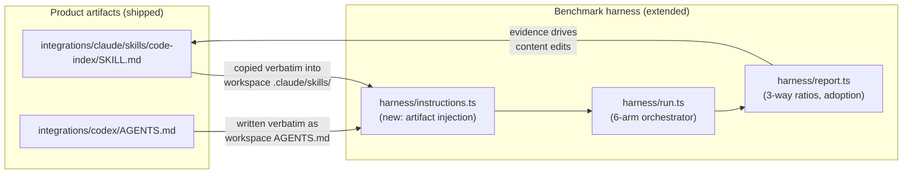

# Skills & Token-Gap Measurement — Architecture

> **Status:** target architecture for a feature set not yet built. It **extends** the
> Phase-1 skills spec ([agent-skills.md](../agent-skills.md)) and the existing benchmark
> harness ([benchmark.md](../benchmark.md), `benchmarks/`) — it replaces neither. The
> existing skeletons under [`integrations/`](../../integrations/) are the starting point
> and are evolved in place. Supporting designs:
> [skill-content-design.md](skill-content-design.md) (what the skills say) and
> [benchmark-measurement.md](benchmark-measurement.md) (how the gap is measured).

## Objective

Ship production skills for **Claude Code** and **Codex CLI** that teach agents to use the
stapler-code-index MCP tools, engineered so that the **token-usage gap between
tool-using agents and baseline agents — as measured by this project's own benchmark
suite — grows substantially**, at equal-or-better correctness. Two deliverables, one
feedback loop:

1. **The skills** — the instruction artifacts users install in target repos.
2. **The measurement** — benchmark wiring that runs the *same shipped artifacts* under
   new instruction-bearing arms and reports the delta, so skill edits are evaluated by
   evidence, not taste.

## Why the current gap is small (evidence)

The suite already runs four arms (`{claude,codex} × {with,without}`), where the with-arm
gets the MCP tools **but no instructions**. `benchmarks/results/2026-08-08-bench.md`
shows what tool availability alone buys:

| Observation | Number | Implication |
|---|---|---|
| Per-category token savings (claude) | ~8–24% | Real but far from the ~20× claim of the [worked example](../mcp-server.md#example-agent-session) |
| Median tool calls per task (claude-with) | 1–2 | Totals are dominated by fixed per-turn context (cache reads), not retrieval |
| `cross-file-navigation` correctness | with 0.00 vs without 1.00 | Un-taught tool use can be actively **worse** — the agent trusts a partial graph answer it wasn't taught to corroborate |
| `rename-refactor` correctness | with 0.50 vs without 1.00 | Missing after-edit discipline (`reindex`, re-verify) loses correctness while saving tokens |

Diagnosis: the with-arm agent uses the index like an extra grep — one shallow call, then
habit. The token story of this project (summaries + id-drill-down, fewer turns, no
full-file reads) is a *sequencing discipline*, and sequencing lives in the instructions
layer. That layer exists as skeletons but is (a) not yet strong enough and (b) invisible
to the harness — there is no arm that loads it, so its effect is unmeasurable today.

## The three components



1. **Skill content** ([skill-content-design.md](skill-content-design.md)) — evolve the
   two skeleton artifacts into prescriptive, budget-oriented playbooks: routing by
   question shape, hard token rules ("never full-file-read after an index hit"),
   turn-collapsing recipes, after-edit and corroboration discipline (fixing the two
   correctness losses above), and explicit fallbacks.
2. **Instruction injection** ([benchmark-measurement.md](benchmark-measurement.md)) — a
   new harness module that installs the shipped artifacts into a run's workspace for the
   new `*-with-skill` arms. The benchmark measures the **exact files users install** —
   no bespoke benchmark prompts.
3. **Measurement & reporting** — six-arm model (`without` / `with` / `with-skill` per
   agent), per-run skill-content hash, cached/uncached token split, an MCP-adoption
   metric (the mediating variable), and three-way headline ratios so the skill's
   contribution is attributable, not inferred.

## Directory structure & layer mapping

The feature follows [layered-architecture.md and the Node.js stack
file](../../.claude/skills/stapler-plan/references/architecture/layered-architecture.md)
as applied to a non-REST Node project: the CLI arg parser is the route/validation seam,
the dependency-injected run loop is the service layer, per-CLI adapters and filesystem
installers are the adapter layer, and `defaultDeps()` is the composition root. Per rule
7 (*scale the ceremony*), no new top-level directories are invented — the feature lands
inside the two existing structures it extends.

```
integrations/                          # DISTRIBUTION ARTIFACTS (data, not code — shipped in the npm tarball via package.json "files")
  claude/
    mcp.json                           #   unchanged template
    skills/code-index/SKILL.md         #   EXTENDED — the Claude skill (single source; benchmark injects this file verbatim)
  codex/
    config.toml                        #   unchanged template
    AGENTS.md                          #   EXTENDED — the Codex section (single source; benchmark injects this file verbatim)
  README.md                            #   updated pointers only

benchmarks/
  tasks.ts, seed-tasks.ts, targets.ts  # DOMAIN (registry data): task/target definitions — extended with gap-surfacing tasks (measurement doc §Task mix)
  harness/
    run.ts                             # APPLICATION + COMPOSITION ROOT: benchRun/executeRun (pure, DI'd) + defaultDeps() (the only place real fs/process wiring happens)
    instructions.ts                    # NEW — APPLICATION (pure plan) + ADAPTER (fs install):
                                       #   planInstructions(arm) -> {source, destRelPath}[]   (pure, unit-testable)
                                       #   installInstructions(workspaceDir, arm)             (fs copy; reached only via the HarnessDeps port)
    report.ts                          # APPLICATION: pure aggregation (3-way headlines, adoption, token split) + thin fs read/write at the edge
    adapters/
      types.ts                         # SHARED KERNEL: Arm union (6 values), RunMetrics, ports — extended
      claude.ts                        # ADAPTER: claude CLI invocation/parsing — extended for the skill arm
      codex.ts                         # ADAPTER: codex CLI invocation/parsing — extended for the skill arm
    graders/                           # ADAPTER: unchanged
  judge/                               # unchanged
  results/                             # OUTPUT (gitignored except dated reports)

docs/
  agent-skills.md                      # remains the production-integration spec; gains pointers here
  skills/                              # this planning docset (architecture, content design, measurement design)

test/
  bench-instructions.test.ts           # NEW — unit: planInstructions purity, install idempotence, arm gating
  integrations-contract.test.ts        # NEW — contract: both artifacts name all 11 tools, no stale tool names,
                                       #        no benchmark-task leakage (see content doc §Guardrails)
.dependency-cruiser.cjs                # NEW — boundary enforcement (below)
```

**Layer table** (ring → what owns it in this feature):

| Ring | Feature elements | Depends on |
|---|---|---|
| Domain / shared kernel | `harness/adapters/types.ts` (Arm, RunMetrics, port types), `tasks.ts`/`targets.ts` registry data | nothing |
| Application | `benchRun`/`executeRun` loop, `planInstructions()`, `buildReport()` aggregation — all pure, all fed through the `HarnessDeps` port | domain |
| Adapters | `adapters/claude.ts`, `adapters/codex.ts`, `installInstructions()` fs half, graders, report render/IO edge | application, domain |
| Infrastructure / composition root | `defaultDeps()` in `run.ts` — constructs real fs, child-process, and artifact-path wiring; the **only** code that knows where `integrations/` lives on disk | everything, at the edge |
| Distribution artifacts | `integrations/**` — markdown/JSON/TOML templates. Not code; no imports in either direction. The harness treats them as read-only input data resolved by the composition root | — |

**Ports & seams.** `HarnessDeps` (already the DI seam of `run.ts`) gains one member,
`installInstructions(workspaceDir, arm): string | null` (returns the injected-content
hash, null for non-skill arms). The run loop stays testable with a fake — no real
artifact files, agents, or fs in harness unit tests. The two CLI adapters stay pure
functions from `InvocationOptions` to argv + from stdout to metrics, exactly as today.

## Boundary rules & enforcement tooling

The project has no boundary tooling today. Install **dependency-cruiser** (devDependency)
at scaffold time per the stack file, with rules encoding this feature's boundaries plus
the pre-existing implicit ones:

```js
// .dependency-cruiser.cjs (rule sketch)
{ name: "src-isolated",        from: { path: "^src" },                        to: { path: "^(benchmarks|test|integrations)" }, severity: "error" },
{ name: "adapters-innermost",  from: { path: "^benchmarks/harness/adapters" },to: { path: "^benchmarks/harness/(run|report|instructions)\\.ts" }, severity: "error" },
{ name: "bench-src-seam",      from: { path: "^benchmarks" },                 to: { path: "^src", pathNot: "^src/storage/meta" }, severity: "error" },  // ratchet: the one existing exception (toolVersion) stays; no new ones
{ name: "no-circular",         from: {},                                      to: { circular: true }, severity: "error" },
```

- npm script `boundaries: depcruise src benchmarks --config .dependency-cruiser.cjs`,
  chained into `pretest` so violations fail the suite, not just CI.
- `integrations/` contains no importable code, so its boundary is enforced differently:
  the composition root is the only module allowed to resolve artifact paths
  (`adapters-innermost` plus code review keep `integrations/...` path literals out of
  the application layer), and `test/integrations-contract.test.ts` enforces the
  artifacts' *content* contract.
- The **single-source rule** — the benchmark injects `integrations/` artifacts verbatim,
  never a copy — is enforced by construction: `planInstructions()` returns paths under
  `integrations/`, and the contract test fails if a second copy of the skill body
  appears anywhere under `benchmarks/`.

## Litmus tests (changeability)

- **Editing skill wording** touches only `integrations/**` — zero harness code. The next
  `bench run` picks it up automatically and records a new `skill_set` hash.
- **Swapping the injection mechanism** (file copy → `--append-system-prompt` diagnostic
  mode) touches `instructions.ts` and one adapter — zero changes to the run loop, report,
  or record schema.
- **Adding a third agent CLI** touches a new adapter module, one `planInstructions()`
  entry, and `defaultDeps()` — the application loop and report aggregation are untouched.
- **A report change** (new ratio, new column) touches `report.ts` and its test only, and
  re-runs free over the existing `runs.jsonl`.

## Decision log

1. **Arms, not a flag: six-value `Arm` union** (`claude-with-skill`, `codex-with-skill`
   added). The arm string is already the unit of analysis in records, grouping, and
   reports; a separate orthogonal flag would put the same fact in two places. The
   `isWithArm`/`endsWith("-with")` predicates become explicit set membership — a
   breaking contract change caught by existing adapter tests. Three arms per agent make
   the skill's contribution *attributable*: `with/without` (tools alone),
   `with-skill/without` (the headline), `with-skill/with` (the skill's own effect).
2. **The benchmark measures the shipped artifacts verbatim.** Injection copies
   `integrations/` files into the workspace unchanged. A benchmark-only prompt would
   optimize a thing users never install; this loop optimizes the product. Corollary: the
   per-run record carries a `skill_set` content hash so results are traceable to skill
   versions.
3. **Injection is per-workspace file installation, matching each CLI's production
   mechanism** — `.claude/skills/code-index/SKILL.md` for Claude (its on-demand skill
   path), `AGENTS.md` at workspace root for Codex (loaded unconditionally by
   `codex exec`). Realism over determinism; a `--append-system-prompt` diagnostic mode
   is specified (measurement doc) for isolating trigger-failure noise, but is never the
   headline number. This repo's own `.claude/skills/` is never touched
   (agent-skills.md decision 1 preserved).
4. **Strictly-additive parity ladder.** `without ⊂ with ⊂ with-skill` — each arm adds
   (tools, then instructions) and removes nothing. The Claude skill arm additionally
   allows the `Skill` tool; nothing else changes between `with` and `with-skill`.
   Instruction context cost is *inside* the measured totals — the skill must pay for
   itself, which is honest and is also why the Codex section stays short.
5. **Correctness is a gate, not a tradeoff.** The headline gap only counts where the
   skill arm's correctness Δ ≥ 0 vs baseline; the report prints correctness beside every
   ratio. Two current with-arm correctness losses are explicit targets for the skill's
   corroboration and after-edit rules.
6. **Two hand-authored artifacts + a contract test, no generator.** The Claude and Codex
   artifacts intentionally diverge (on-demand full playbook vs always-loaded condensed
   table — agent-skills.md decision 3), so a shared-source generator would abstract a
   divergence, not a duplication. Drift is caught by `integrations-contract.test.ts`
   (tool-name completeness, no stale names, no task leakage) instead.
7. **dependency-cruiser installed now, with a ratchet.** First boundary tooling in the
   repo; the one existing cross-boundary import (`run.ts` → `src/storage/meta`) is
   grandfathered by exact path, new ones are errors.
8. **The gap is grown by teaching + measuring, not by handicapping the baseline.** The
   without-arm keeps its full native toolset untouched. Levers: skill content
   (sequencing, turn collapse, drill-down discipline), task mix weighted toward targets
   where structure pays (larger repos, multi-hop questions — measurement doc §Task mix),
   and metrics that expose where savings occur (cached/uncached split). All three are
   legitimate; prompt-engineering the *tasks* to favor the index is not (guardrails in
   the content doc).

## Non-goals

- **Phases 2–3 of agent-skills.md** (Codex plugin packaging, claude.ai remote
  connector) — roadmap unchanged, out of scope here.
- **New MCP tools or server changes** — the 11-tool catalog
  ([mcp-server.md](../mcp-server.md#tool-catalog)) is fixed input to this feature.
- **Cross-agent model-quality claims** — unchanged from benchmark.md; all headline
  comparisons stay within-agent.
- **CI-scheduled benchmark runs** — sessions cost money; runs stay manual.
- **Skills for other agent CLIs** — Claude Code and Codex CLI only, per the Phase-1 scope.
